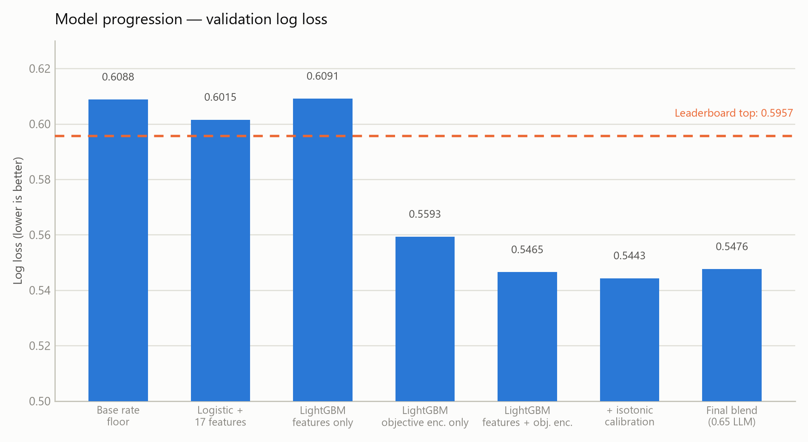
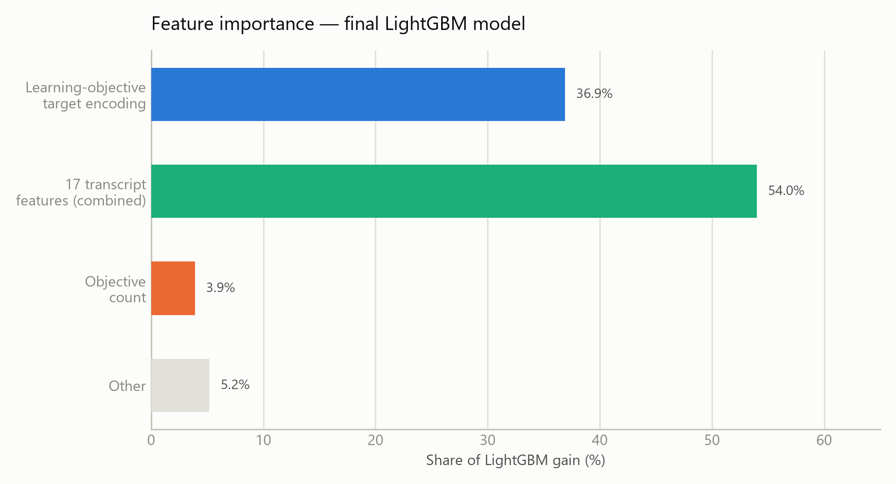
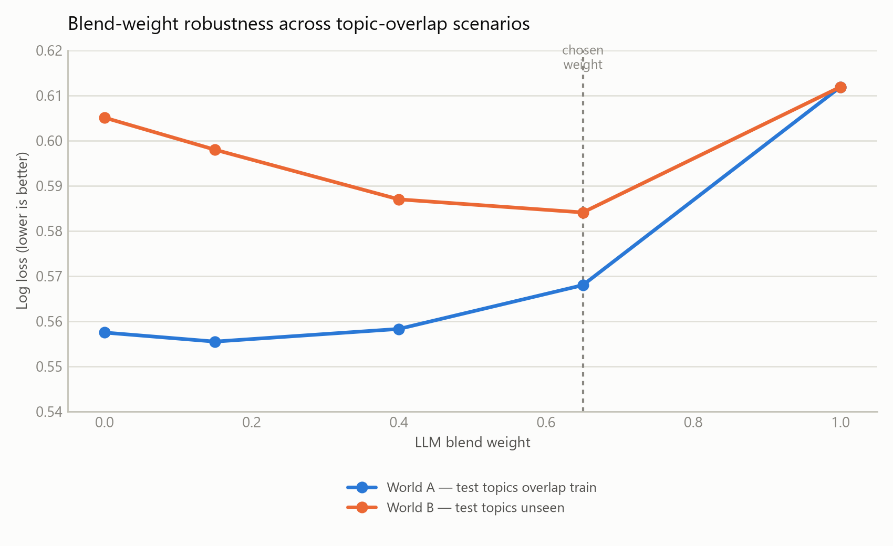

# Trace the Ace 🎓

**Tutoring Outcomes Competition** — predicting whether a student answers their next
assessment question correctly, from a tutoring session transcript.


---

## Overview

[**Trace the Ace**](https://platform.k12-ai-infrastructure.org/competitions/3/tutoring-outcomes/)
is hosted by DrivenData for the National Tutoring Observatory, part of the K-12 AI
Infrastructure Program. Given a full tutoring session transcript (tutor + student
turns) and a short learning-objective description, the task is to predict the
**probability that the student answers the next assessment question on that
objective correctly**.

| | |
|---|---|
| **Metric** | Log loss (lower is better); ROC AUC shown for reference only |
| **Format** | Code-execution challenge — submit `main.py` + `assets/`, organizers run it on hidden test data |
| **Data** | 35,072 responses · 22,821 sessions · 398 learning objectives |
| **Prize pool** | $50,000 — 1st $15k / 2nd $10k / 3rd $7k, plus 9× $2,000 publication bonuses |
| **Judging** | Leaderboard rank **and** a solution write-up (top 15 teams invited) |
| **Model deadline** | 2026-08-27 |

## Results at a glance

| Model | Log loss ↓ | AUC ↑ |
|---|---|---|
| Base-rate floor | 0.6088 | 0.500 |
| Public reference baseline (blog post) | 0.6054 | 0.5473 |
| Logistic regression, 17 transcript features | 0.6015 | 0.5754 |
| LightGBM, transcript features only | 0.6091 | 0.5575 |
| LightGBM, learning-objective encoding only | 0.5593 | 0.6949 |
| **LightGBM, features + objective encoding** | **0.5465** | **0.7197** |
| + isotonic calibration | 0.5443 | 0.7180 |
| **Final blend (0.65 × LLM + 0.35 × LightGBM)** | **0.5476*** | **0.7170*** |
| Leaderboard top (as of Aug 24) | 0.5957 | 0.6413 |

<sub>*Held-out, end-to-end container simulation (fold 0 treated as unseen test data). Not yet the leaderboard-scored result.</sub>



The single biggest lift came from **target-encoding the learning objective** —
objective difficulty ranges from a 41% to a 91% base correct-answer rate, and the
17 hand-built transcript features alone couldn't capture that.



## Two models, blended

| | Feature model | LLM model |
|---|---|---|
| **Architecture** | LightGBM + smoothed, cross-fitted learning-objective target encoding (embedding-kNN fallback for unseen objectives) | Qwen2.5-7B-Instruct, QLoRA (4-bit, Unsloth), classification head trained with BCE loss |
| **Input** | 17 hand-built transcript features (word counts, question/hint/correction counts, turn dynamics, MiniLM embedding similarity to the objective) | Objective text + transcript (truncated to 3072 tokens: first 5 turns + as much of the tail as fits) |
| **Training data** | Full 35,072 rows, 5-fold `GroupKFold` by `session_id` | 4,000 rows/fold (see finding below) — 3 folds trained |
| **Held-out score** | 0.5465 / 0.7197 | 0.6075 / 0.6297 (fold 0) |
| **Reads the transcript?** | Indirectly, via 17 summary features | Directly — the raw conversation |

The feature model is stronger on paper, but its strength is largely **topic
memorization**: it leans on which learning objective is being tested. The
competition explicitly discourages solutions based only on inferred
objective-difficulty rather than the transcript itself — both for the write-up
score and because it's a fragile shortcut if test-set topics don't overlap
training. The LLM reads the actual conversation and should generalize better to
unseen topics, at some cost in raw accuracy on seen ones.

### Why blend at 0.65 LLM weight



Two scenarios were evaluated on held-out data:

- **World A** — test-set learning objectives overlap the training set (session-grouped CV): the feature model's topic encoding transfers, and a *low* LLM weight wins.
- **World B** — test-set objectives are unseen (objective-grouped CV): the encoding falls back to the population prior, the feature model degrades to 0.605, and a *high* LLM weight wins.

There's no way to know in advance which world the hidden test set is in. **0.65** was
chosen as a deliberate robustness trade-off — it costs ~0.012 log loss in World A in
exchange for ~0.021 log loss saved in World B, and the worst case across both
scenarios (0.584) still beats the leaderboard top (0.5957).

## Pipeline

```
train_transcripts/ (22,821 sessions)
          │
          ▼
01-eda-features.ipynb ─────► 17 feat_* columns + canonical CV folds (GroupKFold × 5, seed 42)
          │
          ▼
02-baseline-model.ipynb ───► logistic regression sanity check (0.6015 / 0.5754)
          │
          ▼
03-llm-finetune.ipynb ─────► Qwen2.5-7B QLoRA, 3 folds × 4,000 rows, BCE classification head
          │
          ▼
  ┌───────────────────┐        ┌──────────────────────────┐
  │ LightGBM +         │        │ LLM fold predictions      │
  │ objective encoding │        │ (0.65 weight)              │
  │ (0.35 weight)       │        │                            │
  └─────────┬──────────┘        └─────────────┬──────────────┘
            └───────────────┬─────────────────┘
                             ▼
                  weighted blend → submission.zip
                  (main.py + assets/, no inference-time internet)
```

## Repository structure

```
.
├── README.md                                     you are here
├── Context.md                                     competition rules, data schema, modeling plan (source of truth)
├── MEMORY.md                                      full project log: every experiment, score, bug, and decision
├── Tutoring_Outcomes_Competition_Problem_Statement.pdf
├── submission.zip                                 packaged code-execution submission
├── assets/                                        chart images used in this README
└── notebooks/
    ├── 01-eda-features.ipynb                      EDA + 17 transcript features + canonical CV folds
    ├── 02-baseline-model.ipynb                     logistic regression baseline
    └── 03-llm-finetune.ipynb                       Qwen2.5-7B QLoRA fine-tune
```

## Key engineering decisions

- **Session-grouped CV throughout** — a session can produce multiple responses (one per objective), so rows aren't independent; every fold is grouped by `session_id` to avoid leakage.
- **Leakage-safe target encoding** — the learning-objective encoding is cross-fitted: a validation fold only ever sees an encoding built from *other* folds' data, and even within the training set it's computed out-of-fold.
- **Embedding-kNN fallback** for objectives unseen at inference time — an unseen objective borrows the target rate of its nearest seen objectives by MiniLM similarity, so the encoding degrades gracefully instead of breaking.
- **End-to-end container simulation before trusting any score** — `main.py` is run exactly as the competition runtime would, on a held-out fold treated as genuinely unseen data. This caught two bugs (a pandas 3.x empty-series edge case, a train/inference mismatch in the kNN fallback) that cross-validation alone missed.
- **Feature parity check** — the inference-time feature engineering reproduces the training notebook's output to ~1e-15, eliminating the most dangerous class of train/serve skew bug.
- **No inference-time internet** — all model weights and a manylinux LightGBM wheel are bundled into `assets/`; the LLM stage is wrapped so any failure degrades to the LightGBM prediction rather than crashing the run.

See [`MEMORY.md`](MEMORY.md) for the complete log, including every dead end (six
separate training-environment failures during the QLoRA fine-tune, a dataset
mount-path quirk on Kaggle, a default-argument bug that silently no-opped a
smoothing sweep) and the reasoning behind each decision.

## Status

**Nothing has been submitted to the competition yet.** The feature-only model is
built and verified; the LLM-blended submission is pending final fold results.
Current plan and open risks are tracked in [`MEMORY.md`](MEMORY.md#7-tomorrows-plan).

## License

MIT (required for prize eligibility — see `Context.md` for full competition rules).
